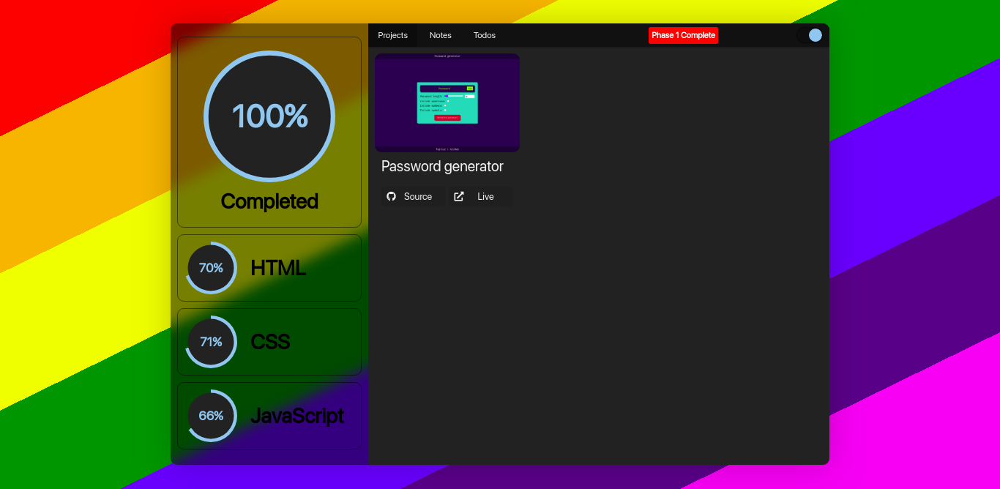

# GADS 2020

A project I created during the learning phase of GADS 2020



## Project setup

Run `npm i` to install all npm packages
In vscode, install the following extensions

> live sass compiler
> live server

use the following configs for `live sass compiler`

```
"liveSassCompile.settings.generateMap": false
"liveSassCompile.settings.formats": [
    {
      "format": "expanded",
      "extensionName": ".css",
      "savePath": "/css"
    }
  ]
```
